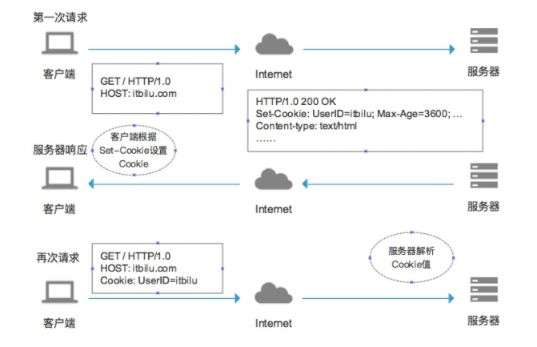
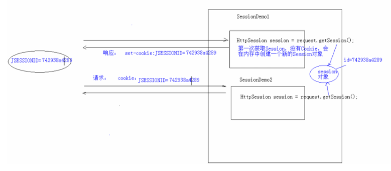

# CookieAndSession

## 会话技术
    1. 会话：一次会话中包含多次请求和响应
        一次会话：浏览器第一次给服务器资源发送请求，会话建立，直到有一方断开为止

    2. 功能：在一次会话的范围内的多次请求间，共享数据

    3. 方式：
        客户端会话技术：Cookie
        服务器端会话技术：Session

## Cookie

### 概述
    1. 概念：客户端会话技术，将数据保存到客户端

    2. 快速入门：
        * 使用步骤：
            <1> 创建Cookie对象，绑定数据
                new Cookie(String name,String value);

            <2> 发送Coookie对象
                response.addCookie(Cookie cookie);

            <3> 获取Cookie，拿到数据
                Cookie[] resquest.getCookies();

    3. 为什么需要使用Cookie
        * 这是因为客户端与服务器基于Http协议，而该协议是无状态的。也就是说建立连接传输数据完成之后，连接会关闭，
          无法实现数据共享，Cookie就能解决该问题

     4. cookie的细节
        1. 一次可不可以发送多个cookie？
            可以，可以创建多个cookie对象，使用response多次调用addCookie()方法发送Cookie即可

        2. cookie在浏览器中能保存多长时间
            <1> 默认情况下，（cookie存储在浏览器中）但浏览器被关闭后，Cookie数据被销毁
            <2> 持久化存储：
                setMaxAge(int seconds)
                    正数：将cookie数据写到硬盘文件中，持久化存储，并且指定cookie的存活时间
                    负数：默认值
                    零：删除cookie信息

        3. cookie能不能存储中文
            在tomcat8之前不能直接存储中文数据,需要将中文数据转码，一般采用URL编码
            在tomcat8之后可以直接存储中文数据头，特殊字符还是不支持，建议使用URL编码存储，使用URL编码来解析

        4. cookie的共享问题
            <1> 假设在一个tomcat服务器中，部署了多个web项目，那么这些项目中的cookie能不能共享？
                默认情况下不能共享

                setPath(String path):设置cookie的取值范围。默认情况下设置的是当前的虚拟目录
                    如果同台服务器下的所有项目需要共享，则将path设置为"/"即可

            <2> 不同的tomcat服务器间cookie共享问题
                setDomain(String path):如果设置一级域名相同，那么多个服务器之间cookie可以共享
                如：setDomain(".baidu.com"),那么tieba.baidu.com和news.baidu.com中cookie可以共享

        5.cookie的特点和作用：
            * 特点
                <1> cookie缓存数据在客户端（安全性较低）
                <2> 浏览器对于单个cookie的大小有限制（4kb）以及对同一个域名下的总cookie数量也有限制（20个）

            * 作用：
                <1> cookie一般用于存储少量的不太重要的数据
                <2> 在不登录的情况下，完成服务器对客户端的身份识别
    

### Cookie实现原理：
        客户端请求服务器后，如果服务器需要记录用户状态，服务器会在响应信息中包含一个Set-Cookie的响应头，客户端
        会根据这个响应头存储Cookie信息。再次请求服务器时，客户端会在请求信息中包含一个Cookie请求头，而服务器会
        根据这个请求头进行用户身份、状态等较验。

## Session

### 概述
    1. 概念：服务器端会话技术，在一次会话的多次请求间共享数据，将数据保存在服务器端的对象中。HttpSession
    
    2. 快速入门：
        <1> 获取HttpSession对象：
            HttpSession session = request.getSession();
        <2> 使用HttpSession对象：
            Object getAttribute(String name);
            void setAttribute(String name,Object value);
            void removeAttribute(String name);

    4. 细节：
        <1> 当客户端关闭后，服务器不关闭，两次获取的Session是否为同一个？
            默认情况下，不是同一个。
            如果需要相同，那么可以创建cookie，键为JSESSIONID值为session.getId(),并设置cookie的最大存活时间
            让cookie（在指定时间内）持久化保存

        <2> 客户端不关闭，服务器关闭后，两次获取的session是否相同？
            不是同一个，但是需要确保数据不会丢失
                session的钝化：
                    在服务器正常关闭之前，将session对象序列化到硬盘上
                session的活化：
                    在服务器启动后，将session文件转换为内存中的session对象即可

            注意：tomcat8会自动帮我们完成session的钝化与活化，但是在IDEA中不能实现这一效果，
                    因为IDEA（活化不成功0）会自动把原来的work文件夹删除然后再开启服务器是再新建一个work文件夹，
                    保存在里面的数据丢失

        <2> Session什么时候被销毁
            1) 服务器被关闭
            2) Session的对象调用invalidate()方法
            3) Session对象的默认失效时间：30分钟
                可以进行配置：
                    在web.xml中
                    <session-config>
                        <session-timout>30</session-timout>
                    </session-config>

    5.Session特点：
        <1> Session可用于存储一次会话的多次请求的数据，存在服务器端
        <2> session可以存储任意类型，任意大小的数据

        <3> Session与cookie的区别：
            1) session存储数据在服务器端，cookie存储在客户端
            2) session没有数据大小限制，而cookie是由数据大小限制的
            3) session数据安全，cookie数据相对不安全

### Session原理：
    1. Session的实现是依赖于Cookie，服务器通过cookie来确定在一次会话范围内，多次获取的session是同一个对象

    

   