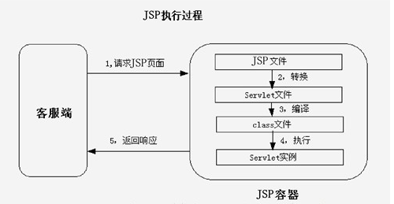

# Jsp

##  概述
    1. 概念：
        Java Server Pages：Java服务器端页面
            可以理解为：一个特殊的页面，其中既可以定义html标签，又可以定义Java代码。用于简化书写

    2. 指令
        <1> 作用：用于配置JSP页面，导入资源文件

        <2> 格式：
            <%@ 指令名称 属性名1=属性值1 属性名2-属性值2 ...%>
            
        <3> 分类：
            1) page:配置JSP页面的
                * 属性：
                    * content-type:等同于response.setContentType()
                        1.设置响应体的mime类型以及字符集
                        2.设置当前jsp页面的编码（只有高级的IDE开发工具才能生效，如果使用低级工具,则需要设置pageEncoding属性
                          设置当前页面的字符集）

                    * import：导包

                    * errorPage：指定跳转出错误页面，当页面发生异常后，会自动跳转到指定的错误页面

                    * isErrorPage：标识当前页面是否为错误页面
                        true：是错误页面，可以使用内置对象exception
                        false：不是错误页面，不能够使用内置对象exception

            2) include:页面包含的，导入页面资源(用于页面中包含页面)
                <%@include file="top.jsp"%>

            3) taglib:导入资源(用于引入标签库)
                <%@taglib prefix="c" uri="http://java.sun.com/jsp/jstl/core"%>
                    prefix:前缀，可以自定义

    3. 注释
        <1> html注释：
            <!-- 注释内容-->:只能注释html代码片段

        <2> jsp注释：（推荐使用）
            <%--注释内容--%>：可以注释所有

## Jsp执行原理
    1. JSP本质上是一个Servlet。(服务器要回应客户端，说明这是一个Servlet)
            当客户端请求了JSP页面时：
                <1> 服务器解析请求消息，找是否有jsp资源
                <2> 如果找到了，会将jsp文件转换为servlet的java文件
                    * 该java文件继承了HttpJspBase，而HttpJspBase类又继承了HttpServlet，此时会掉用该类中的jspInit()以及jspService()提供服务
                <3> 编译编译java文件，生成class字节码文件
                <4> 由字节码文件提供访问
                    

## JSP的脚本：JSP定义Java代码的方式
    1. <%  代码 %>：定义的Java代码，在service方法中，service方法中可以定义什么，该脚本就能定义什么。

    2. <%! 代码 %>：定义的Java代码，在jsp转换后的Java类的成员位置。

    3. <%= 代码 %>:定义的java代码，会输出到页面上。输出语句中定义什么，该脚本就能定义什么。

## Jsp的内置对象
    1. 内置对象：在jsp页面中不需要获取和创建，可以直接使用的对象即为jsp的内置对象。jsp中一共有9个内置对象
        <1> request 

        <2> response

        <3> out：字符输出流对象。可以将数据输出到页面上。和response.getWriter()类似
            * out.write()与response.getWriter()的区别：
                在tomcat服务器在真正给客户端做出响应之前，会先找到response缓冲区，再找out缓冲区数据，
                response.getWriter()数据输出永远在out.write()之前

        <4> 内置对象
            在jsp页面中，不需要创建，可以直接使用的对象
            一共有9个：前面4个为域对象可以实现数据共享
                    变量名             真实类型                        作用
                PageContext         PageContext                 当前页面共享数据，还可以获取其他8个内置对象
                request             HttpServletRequest          一次请求访问的多个资源(通过转发实现)
                session             HttpSession                 一次会话的多次请求间的资源共享
                application         ServletContext              所有用户间的共享数据
                response            HttpServletResponse         响应对象
                page                Object                      当前页面（Servlet）的对象 this
                out                 JspWriter                   输出对象，数据输出到页面上
                config              ServletConfig               Servlet的配置对象
                exception           Throwable                   异常对象