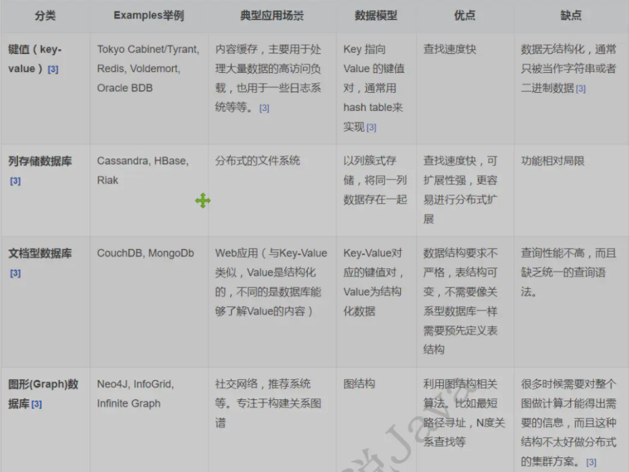

# Redis

## Nosql概述

    1. 概念
        * NoSQL用于超大规模数据的存储。现在大多与关系数据库管理系统（RDBMS）结合使用
        * NoSQL，指的是非关系型的数据库。NoSQL有时也称作Not Only SQL的缩写

    2. 为什么使用Nosql
        
        * 用户的个人信息，社交网络，地理位置，用户生成的数据和用户操作日志已经成倍的增加。Nosql能很好处理这些数据

    3. 特点

        * 方便扩展，数据之间没有关系，很好扩展
        * 大数据量高性能（Redis 一秒写 8 万次，读取 11 万，NoSQL的缓存记录级，是一种细粒度的缓存，性能比较高）
        * 数据类型是多样型的！（不需要事先设计数据库！随取随用！）

    4. 大数据时代要求
        1. 海量Volume                   1. 高并发
        2. 多样Variety                  2. 高可扩
        3. 实时Velocity                 3. 高性能

    5. 四大数据类型
        * KV键值对
        * 文档型数据库（bson格式 和json一样）
        * 列存储数据库
        * 图形数据库



    6. NoSQL的优点/缺点
        * 优点:
            - 高可扩展性
            - 分布式计算
            - 低成本
            - 架构的灵活性，半结构化数据
            - 没有复杂的关系
        * 缺点:
            - 没有标准化
            - 有限的查询功能（到目前为止）
            - 最终一致是不直观的程序


## Redis概述
    1. 概念
        * Redis（Remote Dictionary Server )，即远程字典服务

    2. 作用
        * 内存存储、持久化数据
        * 效率高，可以用于高速缓存
        * 发布订阅系统
        * 地图信息分析

    3. 特性
        * 多样的数据类型
        * 持久化
        * 集群
        * 事务
    
    4. redis总共包含16个数据库，默认在0，默认端口 6379 单线程操作 对3字节的数据读写能达到 读11万次/秒 8万次/秒

    5. 为什么redis是单线程的，速度还这么快？
        * 因为redis是直接操作内存的，并且单线程相对于多线程来说是没有线程上下文的切换的，所以速度快。
    

## 安装Redis
    1. windows系统
        <1> 下载：https://github.com/dmajkic/redis/releases
        <2> 解压到目录
        <3> 配置文件redis.windows.conf
        <4> 打开redis-server.exe 
        <5> 打开redis-cli.exe，执行redis-cli.exe -h 127.0.0.1 -p 6379

    2. linux系统
        <1> 下载地址：http://redis.io/download，下载最新稳定版本    
        <2> 执行下载命令：wget http://download.redis.io/releases/redis-4.0.13.tar.gz
        <3> 解压： tar -zxvf redis-4.0.13.tar.gz
        <4> 执行： cd redis-4.0.13 
        <5> 编译： make (可以在后面加上PREFIX=路径来指定安装路径)
        <6> 复制一份redis.conf，备份使用：cp redis.conf myredis.conf
        <7> 以配置文件redis.conf启动服务： src/redis-server ./redis.conf
        <8> 设置为后台启动：vi redis.conf  将daemonize设置为yes
        <9> 使配置文件生效：src/redis-server redis.conf
        <10> 客户端连接redis: src/redis-cli
        <11> 查看redis进程是否开启： ps -ef | redis
        <12> 关闭服务 shutdown
        <13> redis-benchmark测试性能，100 个并发连接 100000 请求：
             redis-benchmark -h localhost -p 6379 -c 100 -n 100000

## 五大数据类型

### String类型
    1. string类型的操作

```     
redis-cli -h 127.0.0.1 -p 6379 -a "mypass"          程连接 h表示主机 p表示端口 a表示密码
ping                                                检查是否连接，成功返回pong
select 3                                            切换至3号数据库
dbsize                                              查看当前数据库的 数据量  一般为 k-v 的对数
keys *                                              查看当前库中的所有 key
flushdb                                             清空当前数据库
flushall                                            清空所有数据库
dbsize                                              查看数据库数据量
set name zhangsan                                   设置值为zhangsan k-v数据
get name                                            返回这个key对应的值 
exits name                                          判断当前key是否存在  存在返回1否则返回0
move name 1                                         移除key
expire name 10                                      设置这个k-v的过期时间为10秒
ttl name                                            查看这个k-v剩余的有效期时间
type name                                           查看当前key的类型
append name "123"                                   将123拼接到name对应的value值后面 如果key不存在则等价于set
strlen name                                         查看这个key对应的value值的长度
incr num                                            自增1 下次get num将返回1
decr num                                            自减1 下次get num将又返回0
incrby num 5                                        设置自增的步长 自增5 
decrby num 5                                        设置自减的步长 自减5 
getrange name 1 2                                   范围获取 返回name对应value的一部分 从下标1开始到下标2结束  
getrange name 0 -1                                  范围获取 返回name对应value的一部分 从下标0开始到末尾  
setrange name 1 aa                                  将name下标1开始的内容替换为 aa  
setex name1 10 "aaa"                                如果name1不存在则创建k-v并指定过期时间10秒，具有原子性。
                                                    如果存在则覆盖value指定过期时间10秒
setnx name2 bbb                                     如果不存在这个key则创建成功返回1，如果存在 则创建失败返回0
mset k1 v1 k2 v2 k3 v3                              批量设置这3个k-v对
mget k1 k2 k3                                       批量返回相应k值的相应value值
msetnx k1 v1 k4 v4                                  批量不存在时设置，具有原子性，如此时k1存在k4不存在，全部失败返回0
set user:1 {name:zhangsan,age:10}                   保存对象
mset user:1:name zhangsan user:1:age 10             也可有上述效果
getset name ccc                                     先get再set 不存在时 返回nil，但set仍然会生效！等价与创建了一个新
                                                    的k-v。存在时返回之前的value值且覆盖掉这个value，下次get会返回刚
                                                    设置的新值

```      
    2. String类似的使用场景：value除了是我们的字符串还可以是我们的数字
        * 计数器
        * 统计多单位的数量
        * 粉丝数
        * 对象缓存存储


### List类型
    1. List类型操作

```
        LPUSH list xxx             将一个值或者多个值，插入到列表头部 （左）
        LRANGE list 0 -1           获取list中值
        Rpush list xxx             将一个值或者多个值，插入到列表位部 （右）


```