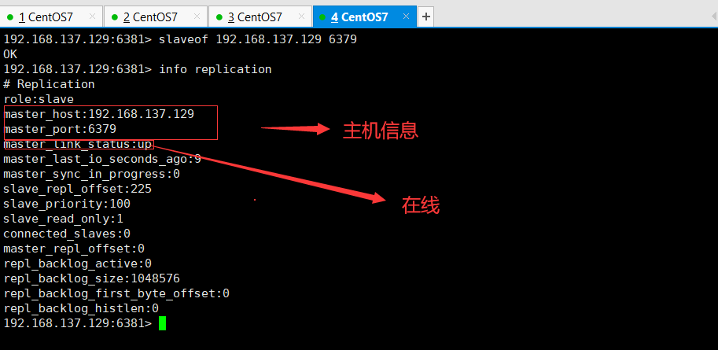
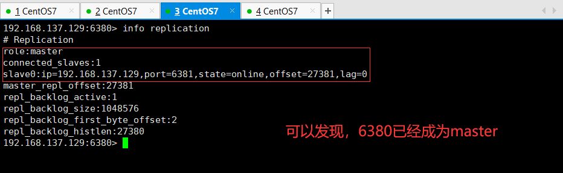

# Redis

## Redis持久化

### Redis持久化概述
    1. 什么是持久化？
        在redis中，数据时缓存在内存中的，如果服务器宕机了，那么数据就会丢失，所以提供了持久化功能，持久化保存
        数据，redis中的持久化包括RDB(Redis DataBase)和AOF(Append Only File)。

### RDB
    1. RDB 介绍
        <1> RDB持久化执行过程
            Redis会单独创建（fork）一个子进程来进行持久化，会先将数据写入到一个临时文件中，待持久化过程都结束
            了，再用这个临时文件替换上次持久化好的文件。整个过程中，主进程是不进行任何IO操作的。这就确保了极高
            的性能。如果需要进行大规模数据的恢复，且对于数据恢复的完整性不是非常敏感(即对数据完整性要求不高)，
            RDB方式要比AOF方式更加的高效。RDB的缺点是最后一次持久化后的数据可能丢失。Redis默认的就是RDB。

        <2> 为什么RDB比AOF的方式效率更高？
            这是因为RDB是将直接将数据进行保存，而AOF是保存的是指令。在恢复数据时，RDB直接恢复数据，而AOF则是
            需要执行所有指令，所以RDB效率较高

        <3> RDB 备份
            使用linux中的cp 命令完成备份即可

        <4> 如果redis启动时，上次关闭redis的目录下没有dump.rdb文件，那么启动redis后，之前redis的数据就没有了

    2. 优点与缺点
        优点：
            <1> 适合大规模的数据恢复
            <2> 对数据的完整性要不高
        缺点：
            <1> 需要一定的时间间隔进程操作！如果redis意外宕机了，这个最后一次修改数据就消失了
            <2> fork进程的时候，会占用一定的内容空间

### AOF
    1. AOF介绍
        <1> AOF保存的是所有执行的写的指令(没有读的指令)，只能追加文件不能改写，redis重启后，就是将所有的指令
            重新执行一遍以达到恢复数据的目的

        <2> AOF和RDB同时开启，那么redis使用哪个呢？
            当它们同时开启时，以aof为主。因为在通常情况下AOF文件保存的数据集要比RDB文件保存的数据集要完整。
            使用aof恢复数据。如果使用aof持久化，不小心清空了数据(flushdb),那么可以使用vim编辑aof文件，将该
            指令(flushdb)删除。注意：aof文件以*开头，$结束

        <3> AOF文件损坏使用redis-check-aof --fix可以完成修复

        <4> aof文件重写
            * AOF采用文件追加方式，文件会越来越大为避免出现此种情况，新增了重写机制,当AOF文件的大小超过所设
              定的阈值时，Redis就会启动AOF文件的内容压缩，只保留可以恢复数据的最小指令集.可以使用命令bgrewr
              iteaof

            * 参考配置文件 no-appendfsync-on-rewrite no

            * 重写规则(参考配置文件)
                auto-aof-rewrite-percentage 100
                auto-aof-rewrite-min-size 64mb

                即 如果Redis的aof文件时base_size的base_size +base_size*100%(2倍)并且大小要大于64mb时，
                   会进行重写


    2. 优点与缺点
        优点：
            <1> 每一次修改都同步，文件的完整会更加好
            <2> 每秒同步一次，可能会丢失一秒的数据
            <3> 从不同步，效率最高的
        缺点：
            <1> 相对于数据文件来说，aof远远大于 rdb，修复的速度也比 rdb慢
            <2> Aof 运行效率也要比 rdb 慢，所以我们redis默认的配置就是rdb持久化

## Redis发布订阅   

## 主从复制

## 主从复制概述

    1. 概述
        <1> 主从复制，就是主机数据更新后根据配置和策略，自动同步到备机的master/slaver机制，Master以写为主，
            Slave以读为主

        <2> 主要作用
            1) 故障恢复：当主节点出现问题时，可以由从节点提供服务，实现快速的故障恢复

            2) 读写分离，性能扩展

    2. 主从复制使用相关的指令
        info replication                            查看当前库的信息(查看主从复制信息)
        slaveof  <ip>  <port>                       配置该服务器为某个服务器的从机

    3. 配置文件中的include指令
        表示引入已有的配置文件，使用include引入后，如果在文件中配置了信息，那么会将引入配置文件中的信息覆盖。如：
        设置daemonize yes后会将原来的daemonize no覆盖掉

    4. 主从复制中一主二从的注意事项
        <1> 主机实现写的操作，从机只能实现读的操作

        <2> 当主机宕机后，从机只会原地待命，不能恢复为主机，查看从机主从复制信息会显示该机的master已下线(down)

        <3> 当主机回来后，主机新增的记录，依然能够顺利复制到从机中

        <4> 当一台从机宕机后，之后该从机恢复后，依然能够跟上其它从机的节奏 

        <5> 通过指令实现的主从复制都是临时的，比如我们下面配置的主从复制就是临时的

    5. 主从复制中一主二从的原理
        Slave 启动成功连接到 master 后会发送一个sync同步命令。Master 接到命令，启动后台的存盘进程，同时收集
        所有接收到的用于修改数据集命令，在后台进程执行完毕之后，master将传送整个数据文件到slave，并完成一次完
        全同步。
        全量复制：而slave服务在接收到数据库文件数据后，将其存盘并加载到内存中。
        增量复制：Master 继续将新的所有收集到的修改命令依次传给slave，完成同步。
        从机宕机后，只要是重新连接master，一次完全同步（全量复制）将被自动执行。

    6. 主从复制中薪火相传的原理
        上一个slave可以是下一个slave的Master，slave同样可以接收其他slaves的连接和同步请求，那么该slave作为
        了链条中下一个的master, 可以有效减轻master的写压力,去中心化降低风险。风险是一旦某个slave宕机，后面的
        lave都没法备份。


### 配置Redis主从复制之一主二从

    1. 配置从机，不需要配置主机

    2. 开启三个redis服务，复制三个配置文件，修改对应信息
        <1> 在配置文件存放目录处，复制配置文件3份，如下所示
            1) 创建新的配置文件，使用include指令完成配置(也可以复制三个配置文件修改对应信息实现)
    
```shell
[root@localhost redis-3.2.5]# vim redis6379.conf
[root@localhost redis-3.2.5]# cp redis6379.conf redis6380.conf
[root@localhost redis-3.2.5]# cp redis6379.conf redis6381.conf
```
            2) 分别配置3个配置文件信息
                
                * 在配置文件中添加如下信息，并修改其它配置文件(这里引入的配置文件是修改过的，只需要修改不同的内容)

```
include /opt/devlopment/redis-3.2.5/myredis.conf
pidfile /var/run/redis_6379.pid
port 6379
dbfilename dump6379.rdb
```
                * 如果引入的是全新没修该的配置文件，那么需要修改的内容需要加上之前，我们刚开始修改过的内容

                * 配置如下所示


                


    3. 使用三个配置文件开启redis服务
        <1> 指令如下
        
```
[root@localhost redis-3.2.5]# redis-server redis6379.conf 
[root@localhost redis-3.2.5]# redis-server redis6380.conf 
[root@localhost redis-3.2.5]# redis-server redis6381.conf 
```

        <2> 如图所示


    4. 使用redis客户端分别连接三个redis服务器
        <1> 使用如下指令即可连接指定ip和端口号的redis服务器

```
redis-cli -h 指定ip -p 指定端口 -a 指定密码
```
        <2> 连接后，如下所示


    5. 使用info replication 可以查看主从复制信息
        <1> 三个连接如下所示


    6. 完成一主二从的配置
        <1> 将6379作为主机，6380和6381作为6379的两个从机(根据配从不配主的原则)
            1) 在6380和6381下使用如下命令完成配置

```
slaveof 192.168.137.129 6379
```
            2) 配置后，如下所示(查看三个redis的信息)   


        


    7. 主从复制中，主机可以写，但是从机不能写，只能读取操作(从机不能进行写入数据操作)这里不再进行进一步演示


### 配置Redis主从复制之薪火相传
    1. 同理，需要三个配置文件，那么这里就不再重新创建了。（这里我们将之前实现的主从赋复制的配置文件中自动生
       成的内容删除，保持与初始创建一致，然后完成配置薪火相传）

    2. 同样的启动三个redis-server，并使用redis-cli完成对三个服务器的连接

```
[root@localhost redis-3.2.5]# redis-server redis6379.conf 
[root@localhost redis-3.2.5]# redis-server redis6380.conf 
[root@localhost redis-3.2.5]# redis-server redis6381.conf 

[root@localhost redis-3.2.5]# redis-cli -h 192.168.137.129 -p 6379
[root@localhost redis-3.2.5]# redis-cli -h 192.168.137.129 -p 6380
[root@localhost redis-3.2.5]# redis-cli -h 192.168.137.129 -p 6381

```

    3. 使用下列指令完成配置(将6379作为6380的主机，将6380作为6381的主机)

        1) 指令如下

```
slaveof 192.168.137.29 6379
slaveof 192.168.137.129 6380
```

        2) 配置后，使用info replication查看信息，如下所示


        3) 此时，如果6379服务器宕机了，那么6380就可以使用slaveof no one 命令来实现反客为主(由slave转换
           为master)

 

## 哨兵模式

### 哨兵模式概述
    1. 哨兵模式的引入
        主从切换技术的方法是：当主服务器宕机后，需要手动把一台从服务器切换为主服务器，这就需要人工干预，
        费事费力，还会造成一段时间内服务不可用。这不是一种推荐的方式，更多时候，我们优先考虑哨兵模式。
        Redis从2.8开始正式提供了Sentinel（哨兵） 架构来解决这个问题

    2. 哨兵模式的介绍
        反客为主的自动版，能够后台监控主机是否故障，如果故障了根据投票数自动将从库转换为主库。哨兵模式
        是一种特殊的模式，首先Redis提供了哨兵的命令，哨兵是一个独立的进程，作为进程，它会独立运行。其
        原理是哨兵通过发送命令，等待Redis服务器响应，从而监控运行的多个Redis实例。

    3. 哨兵模式的作用
        <1> 通过发送命令，让Redis服务器返回监控其运行状态，包括主服务器和从服务器。
        
        <2> 当哨兵监测到master宕机，会自动将slave切换成master，然后通过发布订阅模式通知其他的从服
            务器，修改配置文件，让它们切换主机。

    3. 哨兵模式的原理
        假设主服务器宕机，哨兵1先检测到这个结果，系统并不会马上进行failover过程，仅仅是哨兵1主观的认
        为主服务器不可用，这个现象成为主观下线。当后面的哨兵也检测到主服务器不可用，并且数量达到一定值时，
        那么哨兵之间就会进行一次投票，投票的结果由一个哨兵发起，进行failover[故障转移]操作。切换成功后，
        就会通过发布订阅模式，让各个哨兵把自己监控的从服务器实现切换主机，这个过程称为客观下线。


### 配置哨兵模式
    1. 哨兵模式的配置，首先需要切换到一主二从的状态(参照前面配置即可完成)

    2. 实现哨兵的配置
        <1> 创建哨兵模式的配置文件，sentinel.conf
            1) 执行vim ./redis/sentinel.conf

            2) 在sentinel.conf文件中添加如下配置:entinel  monitor  mymaster 192.168.137.129 6379  1

               该指令表示，将192.168.137.129 6379设置为主服务器，名字为mymaster。其中1表示至少有一个哨
               兵认为主服务器宕机，才是宕机(代表主机挂了，slave投票看让谁接替成为主机，票数最多的，就会成
               为主机)

        <2> 启动哨兵模式
            1) 执行下列命令，启动哨兵模式
                redis-sentinel ./redis/sentinel.conf

            2) 启动哨兵模式，如下所示


    3. 此时，我们将主服务器6379 shutdown掉，查看变化
        <1> 执行 shutdown 命令


        <2> 查看哨兵模式界面信息


        <3> 使用info replication 查看6380的信息



    4. 如果，此时原来的主机6379回来了，那么它只能成为6380的从机了。哨兵模式的规则就是如此。
        <1> 启动6379，查看6379的主从复制信息


        <2> 同样的，查看哨兵的日志信息


    5. 哨兵模式的优点与缺点
        优点：故障恢复(当主节点不能正常工作时，哨兵会开始自动故障转移操作，它会将失效主节点的其中一个从节
             点升级为新的主节点，并让其他从节点改为复制新的主节点)

        缺点：配置麻烦
            

### 哨兵模式配置文件详解

``` bash
# Example sentinel.conf
# 哨兵sentinel实例运行的端口 默认26379
port 26379
# 哨兵sentinel的工作目录
dir /tmp
# 哨兵sentinel监控的redis主节点的 ip port
# master-name 可以自己命名的主节点名字 只能由字母A-z、数字0-9 、这三个字符".-_"组成。
# quorum 配置多少个sentinel哨兵统一认为master主节点失联 那么这时客观上认为主节点失联了
# sentinel monitor <master-name> <ip> <redis-port> <quorum>
sentinel monitor mymaster 127.0.0.1 6379 2
# 当在Redis实例中开启了requirepass foobared 授权密码 这样所有连接Redis实例的客户端都要提供密码
# 设置哨兵sentinel 连接主从的密码 注意必须为主从设置一样的验证密码
# sentinel auth-pass <master-name> <password>
sentinel auth-pass mymaster MySUPER--secret-0123passw0rd
# 指定多少毫秒之后 主节点没有应答哨兵sentinel 此时 哨兵主观上认为主节点下线 默认30秒
# sentinel down-after-milliseconds <master-name> <milliseconds>
sentinel down-after-milliseconds mymaster 30000
# 这个配置项指定了在发生failover主备切换时最多可以有多少个slave同时对新的master进行 同步，
# 这个数字越小，完成failover所需的时间就越长，
# 但是如果这个数字越大，就意味着越 多的slave因为replication而不可用。
# 可以通过将这个值设为 1 来保证每次只有一个slave 处于不能处理命令请求的状态。
# sentinel parallel-syncs <master-name> <numslaves>
sentinel parallel-syncs mymaster 1
# 故障转移的超时时间 failover-timeout 可以用在以下这些方面：
# 1. 同一个sentinel对同一个master两次failover之间的间隔时间。
# 2. 当一个slave从一个错误的master那里同步数据开始计算时间。直到slave被纠正为向正确的master那
# 里同步数据时。
# 3.当想要取消一个正在进行的failover所需要的时间。
# 4.当进行failover时，配置所有slaves指向新的master所需的最大时间。不过，即使过了这个超时，
# slaves依然会被正确配置为指向master，但是就不按parallel-syncs所配置的规则来了
# 默认三分钟
# sentinel failover-timeout <master-name> <milliseconds>
sentinel failover-timeout mymaster 180000
# SCRIPTS EXECUTION
# 配置当某一事件发生时所需要执行的脚本，可以通过脚本来通知管理员，例如当系统运行不正常时发邮件通知
# 相关人员。
# 对于脚本的运行结果有以下规则：
# 若脚本执行后返回1，那么该脚本稍后将会被再次执行，重复次数目前默认为10
# 若脚本执行后返回2，或者比2更高的一个返回值，脚本将不会重复执行。
# 如果脚本在执行过程中由于收到系统中断信号被终止了，则同返回值为1时的行为相同。
# 一个脚本的最大执行时间为60s，如果超过这个时间，脚本将会被一个SIGKILL信号终止，之后重新执行。
# 通知型脚本:当sentinel有任何警告级别的事件发生时（比如说redis实例的主观失效和客观失效等等），
# 将会去调用这个脚本，这时这个脚本应该通过邮件，SMS等方式去通知系统管理员关于系统不正常运行的信
# 息。调用该脚本时，将传给脚本两个参数，一个是事件的类型，一个是事件的描述。如果sentinel.conf配
# 置文件中配置了这个脚本路径，那么必须保证这个脚本存在于这个路径，并且是可执行的，否则sentinel无
# 法正常启动成功。
# 通知脚本
# shell编程
# sentinel notification-script <master-name> <script-path>
sentinel notification-script mymaster /var/redis/notify.sh
# 客户端重新配置主节点参数脚本
# 当一个master由于failover而发生改变时，这个脚本将会被调用，通知相关的客户端关于master地址已
# 经发生改变的信息。
# 以下参数将会在调用脚本时传给脚本:
# <master-name> <role> <state> <from-ip> <from-port> <to-ip> <to-port>
# 目前<state>总是“failover”,
# <role>是“leader”或者“observer”中的一个。
# 参数 from-ip, from-port, to-ip, to-port是用来和旧的master和新的master(即旧的slave)通
# 信的
# 这个脚本应该是通用的，能被多次调用，不是针对性的。
# sentinel client-reconfig-script <master-name> <script-path>
sentinel client-reconfig-script mymaster /var/redis/reconfig.sh # 一般都是由运维来配置！
```
        
## Redis集群


    
