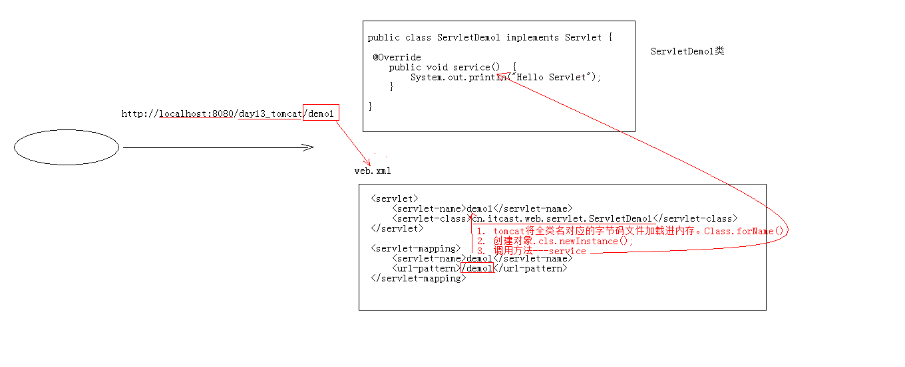

# Servlet

## Servlet概述

## Servlet入门
    1. 声明一个类实现Servlet接口，并实现里面的抽象方法

    2. 配置servlet
        * 在web目录下的web.xml中配置
            * 配置servlet
                <servlet>
                <servlet-name>demo1</servlet-name>      为类的路径定义一个名字
                <servlet-class>com.xuexi.web.servlet.Demo1_Servlet</servlet-class>
                </servlet>
            
            * 配置servlet-mapping
                <servlet-mapping>
                <servlet-name>demo1</servlet-name>
                <url-pattern>/demo1</url-pattern>
                </servlet-mapping>

    3. 启动Tomcat服务器

## Servlet执行原理
    1. 当服务器接收到客户端浏览器的请求后，会解析请求的URL路径，获取访问的Servlet的资源路径
    2. 查找web.xml文件中是否有对应的<url-pattern>标签体内容与资源路径一致
    3. 如果有就找到对应的<servlet-class>全类名
    4. tomcat会将字节码文件加载进内存，然后创建对象
    5. 调用里面的方法

## Servlet生命周期
    1. 创建: 执行init方法，只执行一次，默认情况下，在第一次被访问时，servlet才被创建。
        * 可以配置执行servlet的创建时机。
            在web.xml文件中的<servlet>标签下进行配置
                第一次被访问时创建（默认）：<load-on-startup>的值为负数
                在服务器启动时创建：<load-on-startup>的值为0或正数

        * servlet的init方法，只执行一次，说明Servlet在内存中只存在一个对象，servlet是单例的
            多个用户同时访问时，可能存在线程安全问题
            解决方案：尽量不要在Servlet中创建成员变量，即使定义了成员变量，也不要修改其值

    2. 提供服务: 执行service方法，执行多次，每次访问Servlet时，service方法都会被访问。

    3. 销毁：执行destroy方法，执行一次，Servlet被销时才会被执行，服务器被关闭，Servlet被销毁，只有在正常关闭服务器时，
            才会执行。

## Servlet配置
    1. 注解配置（要求Servlet3.0）
        @WebServelt(urlPatterns={"虚拟目录","路径"},loadOnStartup = -1)

    2. 一个servlet可以定义多个访问路径：
         @WebServlet({"/a","/b","/c"}) 
         @WebServlet("/*")                  * 代表任意，意味着任意路径都可以访问

## Servlet体系结构
    1. HttpServlet继承了GenericServlet，GenericServlet继承了Servlet。

    2. GenericServlet：将Servlet接口类中的其他方法做了默认实现，只将service()方法作为抽象方法
            将来定义Servlet类时，可以继承GenericServlet，只实现service()方法即可

    3. HttpServlet：对http协议的一种封装简化操作。一般使用这种
        <1> 定义类实现HttpServlet
        <2> 重写方法doGet/doPost方法

